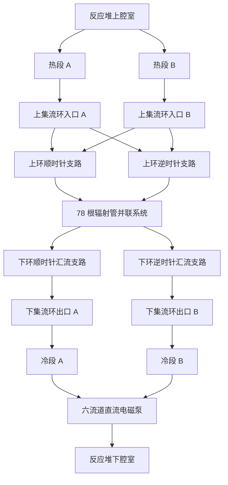

# TOPAZ-II 管翅式辐射器结构、流网拓扑与设计温度调研

> 文档用途：TOPAZ-II 系统级热工水力模型、辐射器子模块建模及论文参数引用  
> 调研对象：TOPAZ-II 原始 NaK-78 强迫循环管翅式辐射器，不包括后续提出的钾热管改型辐射器  
> 整理日期：2026-06-16

---

## 1. 调研结论摘要

TOPAZ-II 采用单回路 NaK-78 液态金属冷却系统。反应堆堆芯出口的高温 NaK 经两条对称热段管路进入辐射器上集流环，上集流环将冷却剂分配至 78 根沿截锥母线方向布置的辐射管。每根辐射管外焊接铜质辐射带，铜带外表面涂覆黑色搪瓷。冷却剂在辐射管内由上向下流动并向空间排热，随后进入下集流环，经两条对称冷段管路流向电磁泵，最终返回反应堆入口。

辐射器的主要直接文献参数为：

- 辐射管数量：78 根；
- 辐射器轴向高度：1.83 m；
- 辐射管实际流动长度：约 1.85 m；
- 辐射管外径：8 mm；
- 辐射管壁厚：0.5 mm；
- 辐射管内径：7 mm；
- 上、下集流管外径：24 mm；
- 集流管壁厚：1 mm；
- 铜辐射带厚度：0.4 mm；
- 铜辐射带黑色搪瓷表面发射率：0.85～0.92；
- 有效辐射面积：7.2 m²；
- 空辐射器质量：46 kg；
- 名义总流量：约 1.3 kg/s。

设计参数表通常给出堆芯入口/出口温度为 743/843 K，对应约 100 K 温升。因此在忽略连接管路热损失时，可将辐射器入口/出口设计温度近似取为 843/743 K。后续热管辐射器研究使用 843/744 K 作为 TOPAZ-II 设计边界。Paramonov 和 El-Genk 的详细辐射器程序计算则采用 823 K 入口温度和 1.3 kg/s 总流量，得到 727 K 出口温度，即约 96 K 温降。设计值与程序计算值应作为不同口径分别使用。

---

## 2. TOPAZ-II 冷却回路中辐射器的位置

TOPAZ-II 的一次冷却剂为 NaK-78，即约 78 wt% K 和 22 wt% Na。冷却剂流经以下主要部件：

```text
反应堆下腔室
    ↓
37 根 TFE 外侧冷却通道
    ↓
反应堆上腔室
    ↓
两条对称热段管路
    ↓
辐射器上集流环
    ↓
78 根管翅式辐射单元
    ↓
辐射器下集流环
    ↓
两条对称冷段管路
    ↓
每条冷段再分为三条泵流道，共六条
    ↓
直流电磁泵
    ↓
反应堆下腔室
```

Voss 的系统说明指出，反应堆上腔室后的流路分成两个对称支路，以减小系统动量矩；冷却剂离开下集流环后再次分成两个相反且近似相等的支路，随后各自再分成三条流道进入电磁泵。

---

## 3. 辐射器总体几何结构

### 3.1 总体形式

原始 TOPAZ-II 辐射器为截锥形管翅式空间辐射器，主要由以下部件组成：

1. 上部环形集流器；
2. 下部环形集流器；
3. 78 根纵向或沿母线方向布置的辐射管；
4. 与辐射管焊接的铜辐射带；
5. 金属支撑框架；
6. 截锥底部辐射结构。

### 3.2 总体尺寸

| 参数 | 数值 | 属性 |
|---|---:|---|
| 辐射器轴向高度 | 1.83 m | 文献直接值 |
| 上集流环中心线直径 | 0.824 m | 根据系统模型表中的 824 mm 及原文小数点错误校正 |
| 下集流环中心线直径 | 1.346 m | 文献直接值 |
| 截锥半径差 | 0.261 m | 几何计算值 |
| 截锥母线长度 | 1.8485 m，工程取 1.85 m | 几何计算值，与系统模型表一致 |
| 有效辐射面积 | 7.2 m² | 文献直接值 |
| 空辐射器质量 | 46 kg | 文献直接值 |

截锥母线长度按下式计算：

\[
L_r=\sqrt{H^2+\left(\frac{D_l-D_u}{2}\right)^2}
\]

代入：

\[
L_r=
\sqrt{1.83^2+\left(\frac{1.346-0.824}{2}\right)^2}
=1.8485\ \mathrm{m}
\]

因此，热工或压降模型中辐射管长度可取：

\[
L_\mathrm{tube}=1.85\ \mathrm{m}
\]

### 3.3 上集流环直径的小数点问题

Paramonov 和 El-Genk 的 1995 年论文正文将上集流环直径印为 8.24 m。该数值与整个 TOPAZ-II 系统约 3.9 m 的总长度、下集流环直径 1.346 m 以及系统模型输入表均不相容。其 1994 年系统模型表将上集流环相关尺寸列为 824 mm，因此应将原文的 8.24 m 解释为排版或小数点错误，正确量级为：

\[
D_u=0.824\ \mathrm{m}
\]

文章中建议写作“上集流环中心线直径约 0.824 m”，并在注释中说明原始论文存在排版错误。

---

## 4. 辐射管及管翅单元几何

### 4.1 辐射管

| 参数 | 数值 | 属性 |
|---|---:|---|
| 数量 | 78 根 | 文献直接值 |
| 材料 | 1Х18Н10Т 奥氏体不锈钢 | 文献直接值 |
| 外径 | 8 mm | 文献直接值 |
| 壁厚 | 0.5 mm | 文献直接值 |
| 内径 | 7 mm | 由外径与壁厚计算，并由系统模型表确认 |
| 长度 | 1850 mm | 系统模型直接值 |
| 单管平均质量流量 | 0.01667 kg/s | 按 1.3 kg/s 均分计算 |
| 辐射管独立表面发射率 | 未明确给出 | 不宜作为文献直接参数引用 |

辐射管内径为：

\[
D_{i,\mathrm{tube}}
=8-2\times0.5
=7\ \mathrm{mm}
\]

名义均匀分配条件下：

\[
\dot m_\mathrm{tube,avg}
=\frac{1.3}{78}
=0.01667\ \mathrm{kg/s}
\]

### 4.2 铜辐射带

| 参数 | 数值 | 属性 |
|---|---:|---|
| 数量 | 78 条 | 每根辐射管对应一条 |
| 材料 | 铜 | 文献直接值 |
| 厚度 | 0.4 mm | 文献直接值 |
| 长度 | 约 1.85 m | 与辐射管母线长度一致 |
| 表面涂层 | 黑色搪瓷或黑色珐琅 | 文献直接值 |
| 表面发射率 | 0.85～0.92 | 文献直接值 |
| 推荐基准发射率 | 0.88 | 工程建模建议 |
| 上端名义周向宽度 | 33.19 mm | 几何推算值 |
| 下端名义周向宽度 | 54.21 mm | 几何推算值 |
| 平均名义宽度 | 43.70 mm | 几何推算值 |

辐射带沿截锥母线方向布置，其周向宽度随直径增加而增大，不宜视为等宽矩形。若 78 个辐射单元均匀覆盖截锥周向，则第一个近似是将单元宽度取为局部周向节距：

\[
b(z)=\frac{\pi D(z)}{78}
\]

上端：

\[
b_u=\frac{\pi\times0.824}{78}=0.03319\ \mathrm{m}
\]

下端：

\[
b_l=\frac{\pi\times1.346}{78}=0.05421\ \mathrm{m}
\]

因此可将铜辐射带近似为长度 1.85 m、上宽约 33.2 mm、下宽约 54.2 mm 的细长梯形。

若程序将 8 mm 辐射管的外表面与铜带平板区分别建模，可进一步估算净平板宽度：

\[
b_{\mathrm{fin,net}}\approx b-D_{o,\mathrm{tube}}
\]

得到：

- 上端净平板宽度约 25.2 mm；
- 下端净平板宽度约 46.2 mm。

上述宽度均为依据截锥几何和 78 等分条件得到的推算值，不是制造图纸直接给出的尺寸。

### 4.3 辐射面积几何校核

截锥外侧母线面积为：

\[
A_\mathrm{cone}
=\pi(r_u+r_l)L_r
\approx 6.30\ \mathrm{m^2}
\]

下底圆面积为：

\[
A_\mathrm{bottom}
=\pi r_l^2
\approx 1.42\ \mathrm{m^2}
\]

二者合计约 7.72 m²。文献给出的有效辐射面积为 7.2 m²，差异可由支撑框架遮挡、连接区域、非完全有效表面及面积定义方式造成。该校核说明 0.824 m、1.346 m 和 1.85 m 的整体几何量级相互一致。

---

## 5. 上、下集流环几何参数

“集流环内径、外径和长度”存在两种不同含义，应在文章和程序中明确区分：

1. 集流管自身截面的内径和外径；
2. 整个环形集流器的中心线直径、内包络直径、外包络直径及圆周长度。

### 5.1 集流管截面

| 参数 | 上集流环 | 下集流环 | 说明 |
|---|---:|---:|---|
| 集流管外径 | 24 mm | 24 mm | 详细辐射器论文直接值 |
| 壁厚 | 1 mm | 1 mm | 详细辐射器论文直接值 |
| 由几何计算的内径 | 22 mm | 22 mm | \(24-2\times1\) |
| TITAM 系统模型采用的内径 | 20 mm | 20 mm | 系统模型输入表直接值 |

这里存在一个需要保留的文献差异：

- 按外径 24 mm、壁厚 1 mm，几何内径应为 22 mm；
- Paramonov 和 El-Genk 的系统模型输入表将上下集流环内径均取为 20 mm。

可能原因包括有效水力直径修正、局部结构缩径、制造尺寸差异或不同资料版本。建议：

- 建立几何/CAD 模型时采用外径 24 mm、壁厚 1 mm、内径 22 mm；
- 复现 TITAM 压降或流量分配时优先采用 20 mm 有效内径；
- 在论文中明确说明两种口径，不要将 22 mm 写成唯一无争议值。

### 5.2 集流环整体尺寸

| 参数 | 上集流环 | 下集流环 |
|---|---:|---:|
| 中心线直径 | 0.824 m | 1.346 m |
| 中心线半径 | 0.412 m | 0.673 m |
| 中心线全圆周长 | 2.5887 m | 4.2286 m |
| 集流环外包络直径 | 约 0.848 m | 约 1.370 m |
| 集流环内包络直径 | 约 0.800 m | 约 1.322 m |
| 78 等分后单段弧长 | 33.19 mm | 54.21 mm |
| 两个相对接口间半圆弧长 | 1.2943 m | 2.1143 m |
| 单接口至相邻对称分界点的四分之一圆弧长 | 0.6472 m | 1.0571 m |

全圆周长：

\[
L_h=\pi D_h
\]

单个集流环段的中心线弧长：

\[
\Delta L_h=\frac{\pi D_h}{78}
\]

这些弧长适合用于建立 78 节点环形流网。系统模型表中的“上集流环长度 824 mm、下集流环长度 1346 mm”与环中心线直径数值相同，应理解为模型使用的特征尺寸或资料表述差异，不应直接当作完整圆周流动长度。

---

## 6. 双入口、双出口流网拓扑

### 6.1 总体拓扑

TOPAZ-II 辐射器不是简单的单入口—单出口并联管束，而是：

- 上集流环设置两个相对的入口；
- 下集流环设置两个相对的出口；
- 入口和出口方位在详细流网模型中按两组相隔 \(n/2\) 个管位设置；
- 对于 \(n=78\)，两组接口相隔 39 个辐射管节距，即约 180°。

```text
                         反应堆上腔室
                               │
                     ┌─────────┴─────────┐
                     │                   │
                热段管路 A          热段管路 B
               L=2.5 m, ID=30 mm   L=2.5 m, ID=30 mm
                     │                   │
                     ▼                   ▼
             上集流环入口 A       上集流环入口 B
                     ●───────────────────●
                  ↙  ↘                 ↙  ↘
            顺时针/逆时针分流     顺时针/逆时针分流
                 │ │ │ │             │ │ │ │
                 ↓ ↓ ↓ ↓             ↓ ↓ ↓ ↓
                    78 根辐射管
                       由上向下
                 ↓ ↓ ↓ ↓             ↓ ↓ ↓ ↓
                  ↘  ↙                 ↘  ↙
                     ●───────────────────●
             下集流环出口 A       下集流环出口 B
                     │                   │
                冷段管路 A          冷段管路 B
               L=3.5 m, ID=30 mm   L=3.5 m, ID=30 mm
                     └─────────┬─────────┘
                               │
                     两路各分成三路
                               │
                         六流道电磁泵
```

### 6.2 Mermaid 拓扑表示



### 6.3 环内流动规律

上集流环承担分配作用：

- 每个入口的流体向入口两侧分流；
- 环向流量沿流动方向不断进入辐射管；
- 因此环向流量从入口附近的最大值逐段减小；
- 在相邻两个入口之间的对称分界处，环向流量接近零。

下集流环承担汇集作用：

- 冷却剂由各辐射管进入下集流环；
- 环向流量在朝出口方向流动时逐段增加；
- 最终从两个相对出口离开。

在完全对称、总流量 1.3 kg/s 条件下：

\[
\dot m_{\mathrm{in},A}
\approx
\dot m_{\mathrm{in},B}
\approx 0.65\ \mathrm{kg/s}
\]

每个入口向两个圆周方向分流后，入口附近每个环向分支的初始流量约为：

\[
\dot m_{\mathrm{header,branch}}
\approx \frac{1.3}{4}
=0.325\ \mathrm{kg/s}
\]

该值与详细模型中集流环入口附近约 0.32 kg/s 的流量分布相符。

---

## 7. 详细流网离散方式

### 7.1 节点与支路定义

建议将流网离散为：

- 上集流环节点：\(U_1,\ldots,U_{78}\)；
- 下集流环节点：\(L_1,\ldots,L_{78}\)；
- 纵向辐射管：\(T_1,\ldots,T_{78}\)；
- 上集流环弧段：78 段；
- 下集流环弧段：78 段；
- 入口支路：2 条；
- 出口支路：2 条。

每根辐射管连接：

\[
U_i\rightarrow T_i\rightarrow L_i
\]

环形周期边界为：

\[
U_{78}\leftrightarrow U_1
\]

\[
L_{78}\leftrightarrow L_1
\]

两个入口和两个出口分别位于约 \(0^\circ\) 与 \(180^\circ\) 方位，可在编号上设置为：

- 第一组接口：管 78 与管 1 附近；
- 第二组接口：管 39 与管 40 附近。

详细论文的质量守恒方程将第二入口和第二出口放置于 \(n/2\) 与 \(n/2+1\) 的分界位置。对于 \(n=78\)，即 39 与 40 号管之间。

### 7.2 基本闭环方程

相邻辐射管 \(i\) 和 \(i+1\) 与上下集流环相应弧段构成一个水力闭环。其压降平衡可概括为：

\[
\Delta P_{T,i}
+\Delta P_{L,i}
-\Delta P_{T,i+1}
-\Delta P_{U,i}
=0
\]

其中：

- \(\Delta P_{T,i}\)：第 \(i\) 根辐射管压降；
- \(\Delta P_{U,i}\)：上集流环第 \(i\) 段压降；
- \(\Delta P_{L,i}\)：下集流环第 \(i\) 段压降。

各节点同时满足质量守恒。Paramonov 和 El-Genk 使用 Hardy Cross 方法迭代求解各辐射管和集流环段的流量。

### 7.3 推荐的边界条件

完整流网模型建议采用：

- 两个上部入口给定相同入口温度；
- 若热段管路未纳入模型，可先给定每个入口 0.65 kg/s；
- 若热段管路纳入模型，应给定共同上游压力和温度，由两条支路阻力自动求分流；
- 两个下部出口给定相同下游压力，不建议强制各为 0.65 kg/s；
- 所有支路由质量守恒和压降平衡自动计算。

---

## 8. 流量分配不均匀性

### 8.1 均匀初值

详细模型首先采用：

\[
\dot m_i^{(0)}
=\frac{\dot m_t}{78}
\]

当总流量为 1.3 kg/s 时：

\[
\dot m_i^{(0)}
=0.01667\ \mathrm{kg/s}
\]

### 8.2 详细计算结果

在总流量 1.3 kg/s、辐射器入口温度 823 K 条件下，详细模型给出的单管流量大致分布在：

\[
0.0158\sim0.0188\ \mathrm{kg/s}
\]

最大与最小流量之差约为：

\[
\Delta\dot m_\mathrm{tube}
\approx0.003\ \mathrm{kg/s}
\]

约为平均单管流量的 17%～18%。

原论文正文印刷为“0.03 kg/s”，但该值大于单管平均流量，且与文中“约为平均值的 17%”和图中坐标均不相符。因此应解释为：

\[
0.03\ \mathrm{kg/s}
\quad\text{应为}\quad
0.003\ \mathrm{kg/s}
\]

流量最大的辐射管位于集流环入口附近，流量最小的辐射管位于远离入口的对称区域。较低流量使远端辐射管中的 NaK 冷却更充分，导致下集流环入口处沿圆周出现约 15 K 的温度不均匀性。

---

## 9. 进出口温度设计值与计算值

### 9.1 原始设计参数

Voss 的 TOPAZ-II 系统参数表给出：

| 工况 | 堆芯入口温度 | 堆芯出口温度 | 堆芯温升 |
|---|---:|---:|---:|
| 寿期初 BOL | 743 K | 843 K | 100 K |
| 最大热功率工况 MAX | 773 K | 873 K | 100 K |

由于辐射器位于堆芯出口与堆芯入口之间，在忽略连接管路热损失和泵热效应的系统级简化中，可采用：

| 边界 | 寿期初设计值 |
|---|---:|
| 辐射器入口温度 | 约 843 K |
| 辐射器出口温度 | 约 743 K |
| 辐射器温降 | 约 100 K |

后续 TOPAZ-II 热管辐射器改型研究使用 843 K 入口、744 K 出口作为原系统设计边界，对应 99 K 温降，并明确说明该温度变化与 TOPAZ-II 设计值一致。

### 9.2 详细辐射器程序计算工况

Paramonov 和 El-Genk 的详细热工水力模型采用：

| 参数 | 数值 |
|---|---:|
| 辐射器入口温度 | 823 K |
| 辐射器出口温度 | 727 K |
| 温降 | 96 K |
| 总质量流量 | 1.3 kg/s |
| 反应堆热功率 | 115 kW |
| 电输出功率 | 5.6 kW |

该工况对应的废热功率近似为：

\[
Q_\mathrm{reject}
=115-5.6
=109.4\ \mathrm{kW}
\]

由能量平衡反推等效比热：

\[
c_{p,\mathrm{eff}}
=
\frac{109.4}{1.3\times96}
=0.8766\ \mathrm{kJ/(kg\cdot K)}
\]

因此 96 K 的温降与流量和排热功率能够闭合。

### 9.3 设计值与程序计算值的使用原则

不应把 843/743 K 与 823/727 K 混为同一个工况：

- 843/743 K 或 843/744 K：设计边界或后续改型研究采用的设计工况；
- 823/727 K：详细 TITAM 辐射器模型的具体计算工况；
- 二者温差接近，均为约 96～100 K，但绝对温度不同。

文章中建议写作：

> TOPAZ-II 寿期初设计参数给出堆芯入口和出口温度分别为 743 K 和 843 K，因此辐射器设计温降约为 100 K。Paramonov 和 El-Genk 的详细辐射器模型在 1.3 kg/s 流量和 823 K 入口温度下计算得到 727 K 出口温度，对应约 96 K 温降。两组数据分别代表设计参数和特定程序计算工况。

---

## 10. 与当前程序结果的对比建议

若你的程序采用：

- 反应堆热功率：115 kW；
- 电功率：约 4.8 kW；
- NaK 总流量：1.3 kg/s；
- 辐射器或堆芯两端温差：约 96 K；

则：

\[
Q_\mathrm{reject}
=115-4.8
=110.2\ \mathrm{kW}
\]

反推等效比热：

\[
c_{p,\mathrm{eff}}
=
\frac{110.2}{1.3\times96}
=0.8830\ \mathrm{kJ/(kg\cdot K)}
\]

这一结果与详细模型工况反推的 0.8766 kJ/(kg·K) 很接近。论文中可以将程序得到的约 96 K 温差与 Paramonov 和 El-Genk 的 823→727 K 计算结果进行直接比较，同时将 843→743/744 K 作为设计值对比。

---

## 11. 推荐的模型输入参数

### 11.1 几何参数

```text
radiator_type = truncated_cone_tube_fin

number_of_radiator_tubes = 78

radiator_axial_height = 1.830 m
radiator_tube_length = 1.850 m

upper_header_centerline_diameter = 0.824 m
lower_header_centerline_diameter = 1.346 m

header_outer_diameter = 0.024 m
header_wall_thickness = 0.001 m

# 几何模型
header_inner_diameter_geometric = 0.022 m

# TITAM 水力复现
header_inner_diameter_hydraulic = 0.020 m

tube_outer_diameter = 0.008 m
tube_wall_thickness = 0.0005 m
tube_inner_diameter = 0.007 m

fin_material = copper
fin_thickness = 0.0004 m
fin_length = 1.850 m
fin_width_upper = 0.03319 m
fin_width_lower = 0.05421 m
fin_emissivity = 0.88
fin_emissivity_range = 0.85–0.92

effective_radiator_area = 7.2 m2
empty_radiator_mass = 46 kg
```

### 11.2 连接管参数

```text
reactor_exit_to_upper_header:
    number_of_pipes = 2
    length_each = 2.5 m
    inner_diameter = 0.030 m

lower_header_to_EM_pump:
    number_of_pipes = 2
    length_each = 3.5 m
    inner_diameter = 0.030 m

EM_pump_to_reactor_inlet:
    number_of_pipes = 6
    length_each = 1.0 m
    inner_diameter = 0.018 m
```

### 11.3 热工边界

设计值测试：

```text
total_mass_flow_rate = 1.3 kg/s
radiator_inlet_temperature = 843 K
radiator_outlet_target = 743–744 K
temperature_drop = 99–100 K
```

详细程序对比测试：

```text
total_mass_flow_rate = 1.3 kg/s
radiator_inlet_temperature = 823 K
radiator_outlet_target = 727 K
temperature_drop = 96 K
reactor_thermal_power = 115 kW
electric_power = 5.6 kW
```

---

## 12. 建议的单元测试

### Test 1：几何一致性

检查：

\[
L_\mathrm{tube}
\approx
\sqrt{1.83^2+
\left(\frac{1.346-0.824}{2}\right)^2}
\approx1.85\ \mathrm{m}
\]

检查 78 个上、下集流环弧段长度之和分别等于对应圆周长。

### Test 2：全局质量守恒

\[
\dot m_\mathrm{in,1}
+\dot m_\mathrm{in,2}
=
\sum_{i=1}^{78}\dot m_i
=
\dot m_\mathrm{out,1}
+\dot m_\mathrm{out,2}
\]

允许相对残差建议小于：

\[
10^{-8}
\]

### Test 3：完全对称均匀流量初值

\[
\dot m_i=1.3/78
=0.01667\ \mathrm{kg/s}
\]

此测试用于排除拓扑连接和数组编号错误。

### Test 4：详细流量分配趋势

加入集流环压降后，应出现：

- 入口附近辐射管流量较大；
- 远离入口的辐射管流量较小；
- 单管流量约 0.0158～0.0188 kg/s；
- 最大最小差约 0.003 kg/s；
- 分布关于两个入口方位近似周期对称。

### Test 5：温度与能量平衡

详细模型对比目标：

\[
T_\mathrm{in}=823\ \mathrm{K}
\]

\[
T_\mathrm{out}\approx727\ \mathrm{K}
\]

\[
\Delta T\approx96\ \mathrm{K}
\]

并检查：

\[
\dot m c_p(T_\mathrm{in}-T_\mathrm{out})
\approx Q_\mathrm{th}-P_e
\]

### Test 6：出口混合温度

下集流环出口温度应按质量和焓进行混合：

\[
h_\mathrm{out,mix}
=
\frac{\sum_i\dot m_i h_i}
{\sum_i\dot m_i}
\]

若比热近似不变，可写为：

\[
T_\mathrm{out,mix}
=
\frac{\sum_i\dot m_iT_i}
{\sum_i\dot m_i}
\]

不应简单使用 78 根管出口温度的算术平均值，除非各管流量严格相等。

---

## 13. 参数来源与可信度

| 参数 | 推荐值 | 可信度 | 备注 |
|---|---:|---|---|
| 辐射管数量 | 78 | 高 | 多个来源一致 |
| 辐射管长度 | 1.85 m | 高 | 系统模型直接值，与几何计算一致 |
| 辐射管外径 | 8 mm | 高 | 详细辐射器论文直接值 |
| 辐射管内径 | 7 mm | 高 | 论文尺寸计算及模型表一致 |
| 上集流环直径 | 0.824 m | 中高 | 结合 824 mm 模型表校正原文小数点 |
| 下集流环直径 | 1.346 m | 高 | 多处一致 |
| 集流管外径 | 24 mm | 高 | 详细论文直接值 |
| 集流管几何内径 | 22 mm | 中 | 由 24 mm 外径和 1 mm 壁厚计算 |
| 集流管模型内径 | 20 mm | 高 | TITAM 输入表直接值 |
| 铜带厚度 | 0.4 mm | 高 | 详细论文直接值 |
| 铜带发射率 | 0.85～0.92 | 高 | 详细论文直接值 |
| 铜带上/下端宽度 | 33.2/54.2 mm | 中 | 几何推算，不是制造图纸值 |
| 管独立发射率 | 未确定 | 低 | 原文只明确铜带黑色搪瓷发射率 |
| 双入口双出口 | 高 | 高 | 系统说明和流网方程共同支持 |
| 接口相隔约 180° | 中高 | 由 \(n/2\) 编号及对称流路推定 |
| 843/743 K | 高 | 原始系统设计值 |
| 823/727 K | 高 | 详细辐射器程序计算值 |

---

## 14. 文章撰写时的推荐表述

> TOPAZ-II 原始废热排出装置采用截锥形 NaK 管翅式辐射器。辐射器由上、下环形集流器及其间的 78 根辐射管组成，辐射管外径为 8 mm、壁厚为 0.5 mm、流动长度约为 1.85 m。每根辐射管外焊接厚度为 0.4 mm 的铜辐射带，铜带表面涂覆发射率为 0.85～0.92 的黑色搪瓷。上、下集流管外径均为 24 mm，文献给出的几何壁厚为 1 mm，而 TITAM 系统模型采用 20 mm 的集流管有效内径。上、下集流环中心线直径分别约为 0.824 m 和 1.346 m，形成高度约 1.83 m 的截锥结构。
>
> 反应堆出口冷却剂经两条对称热段管路，从相隔约 180° 的两个位置进入上集流环。每股入口流体在集流环内向两个圆周方向分流，并逐步进入 78 根辐射管。冷却剂在辐射管内由上向下流动，随后在下集流环中汇集，经两个相对出口流向电磁泵。集流环压降使各辐射管流量并非严格均匀。详细模型在总流量 1.3 kg/s、入口温度 823 K 条件下得到约 0.0158～0.0188 kg/s 的单管流量范围，并预测下集流环入口处存在约 15 K 的圆周温度不均匀性。
>
> TOPAZ-II 寿期初设计参数给出堆芯入口和出口温度分别为 743 K 和 843 K，因此辐射器设计温降约为 100 K。详细 TITAM 辐射器模型在 1.3 kg/s 流量下采用 823 K 入口温度并计算得到 727 K 出口温度，对应约 96 K 温降。两者分别代表系统设计参数与特定程序计算工况，进行模型验证时应分别列出，避免混用。

---

## 15. 主要参考文献

[1] Voss, S. S. **TOPAZ II System Description**. Los Alamos National Laboratory, 1994.  
OSTI: https://www.osti.gov/servlets/purl/10120556  
IAEA INIS: https://inis.iaea.org/records/tv1mz-4hb06

[2] Paramonov, D. V.; El-Genk, M. S. **A Detailed Thermal-Hydraulic Model of the TOPAZ-II Radiator**. Proceedings of the 12th Symposium on Space Nuclear Power and Propulsion, AIP Conference Proceedings 324(2), pp. 485–493, 1995.  
DOI: https://doi.org/10.1063/1.47139  
UNM ISNPS: https://isnps.unm.edu/publications/252/

[3] Paramonov, D. V.; El-Genk, M. S. **Development and Comparison of a TOPAZ-II System Model with Experimental Data**. Nuclear Technology, Vol. 108, No. 2, pp. 157–170, 1994.  
DOI: https://doi.org/10.13182/NT94-A35027  
OSTI: https://www.osti.gov/biblio/6834335

[4] Zhang, W.; Tian, W.; Qiu, S.; Su, G. **Study on the Improvement of TOPAZ-II System by Using a Heat Pipe Radiator**. NURETH-16, Chicago, 2015.  
PDF: https://glc.ans.org/nureth-16/data/papers/13756.pdf

---

## 16. 仍需进一步确认的问题

1. 上、下集流管的真实制造内径究竟为 22 mm 还是 20 mm。现有资料分别支持几何内径和程序有效内径两种口径。
2. 铜辐射带与辐射管的具体焊接搭接宽度、焊缝热阻及辐射管表面是否完全涂黑。
3. 上、下接口在制造图纸中的精确方位角和轴向对齐关系。详细流网模型支持两组相隔约 180° 的接口，但未找到带角度标注的原始装配图。
4. 7.2 m² 有效辐射面积中，截锥底部、集流环和支撑结构分别计入多少。
5. 原始俄方资料中是否存在更详细的辐射器制造图和尺寸公差。

这些未决参数在系统级模型中影响有限，但在 CFD、有限元热应力或制造级复现中需要进一步查证。
